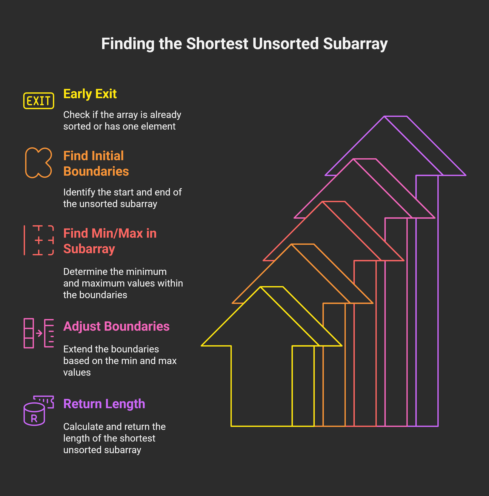

# 581. Shortest Unsorted Continuous Subarray 🎯  
**Solved** ✅  
**Difficulty**: Medium 🟡  
**Topics**: Arrays, Two Pointers  
 

## Problem Description 📝  
Given an integer array `nums`, you need to find **one continuous subarray** that, when sorted in **non-decreasing order**, makes the entire array sorted in non-decreasing order. Return the **length** of the shortest such subarray.  

## Examples 🌟  

### Example 1  
**Input**: `nums = [2, 6, 4, 8, 10, 9, 15]`  
**Output**: `5`  
**Explanation**: Sorting `[6, 4, 8, 10, 9]` in ascending order makes the whole array `[2, 4, 6, 8, 9, 10, 15]`, which is sorted.  

### Example 2  
**Input**: `nums = [1, 2, 3, 4]`  
**Output**: `0`  
**Explanation**: The array is already sorted! 😊  

### Example 3  
**Input**: `nums = [1]`  
**Output**: `0`  
**Explanation**: A single element is always sorted. 🎉  


## Constraints ⚙️  
- `1 <= nums.length <= 10^4`  
- `-10^5 <= nums[i] <= 10^5`  


## Follow-Up ❓  
Can you solve it in **O(n)** time complexity? Let’s find out! 🚀  


## Solution 💡  
To find the shortest unsorted subarray, we need to identify the portion of the array that’s out of order and determine its boundaries. Here’s an **O(n)** approach using two passes:  



### Approach  
1. **Find the Left Boundary** (`start`): Scan from the left to find the first position where the array stops being sorted (`nums[i] > nums[i+1]`).  
2. **Find the Right Boundary** (`end`): Scan from the right to find the last position where the array stops being sorted (`nums[i] < nums[i-1]`).  
3. **Adjust Boundaries**:  
   - Find the `min` and `max` values in the subarray between `start` and `end`.  
   - Extend `start` left if any earlier number is greater than `min`.  
   - Extend `end` right if any later number is less than `max`.  
4. **Return Length**: Compute `end - start + 1`.  

### Code 🖥️  
```python
class Solution:
    def findUnsortedSubarray(self, nums: List[int]) -> int:
        n = len(nums)
        if n == 1:
            return 0
        
        # Step 1: Find first out-of-order from left
        start = 0
        while start < n - 1 and nums[start] <= nums[start + 1]:
            start += 1
        if start == n - 1:  # Array is sorted
            return 0
        
        # Step 2: Find last out-of-order from right
        end = n - 1
        while end > 0 and nums[end] >= nums[end - 1]:
            end -= 1
        
        # Step 3: Find min and max in the subarray
        min_val = float('inf')
        max_val = float('-inf')
        for i in range(start, end + 1):
            min_val = min(min_val, nums[i])
            max_val = max(max_val, nums[i])
        
        # Step 4: Extend start and end based on min/max
        while start > 0 and nums[start - 1] > min_val:
            start -= 1
        while end < n - 1 and nums[end + 1] < max_val:
            end += 1
        
        return end - start + 1
```
## How It Works 🛠️  
**Example**: `[2, 6, 4, 8, 10, 9, 15]`  

- **Left Scan**: `start = 1` (6 > 4)  
- **Right Scan**: `end = 5` (9 < 10)  
- **Subarray `[6, 4, 8, 10, 9]`**:  
    - `min_val = 4`  
    - `max_val = 10`  
- **Adjust**:  
    - `start`: `nums[0] = 2 < 4`, stays at 1  
    - `end`: `nums[6] = 15 > 10`, stays at 5  
- **Length**: `5 - 1 + 1 = 5` ✅  


## Complexity ⏱️  
- **Time Complexity**: **O(n)** – Multiple linear passes through the array.  
- **Space Complexity**: **O(1)** – Just a few variables, no extra arrays!  


## Follow-Up Answer 🎓  
Yes, this solution runs in **O(n)** time complexity, meeting the follow-up requirement! It avoids sorting (O(n log n)) and uses efficient linear scans instead. 🚀  

Happy coding! 😄  

---